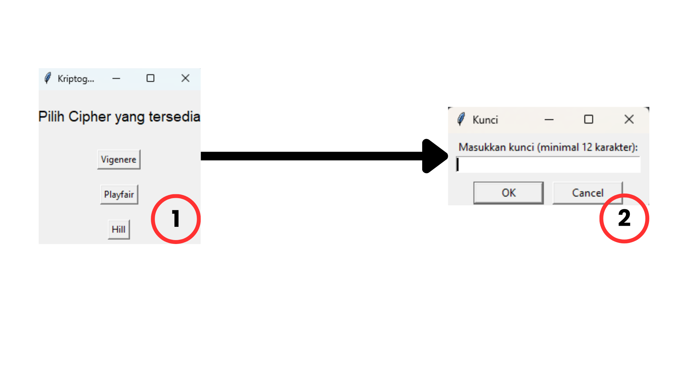
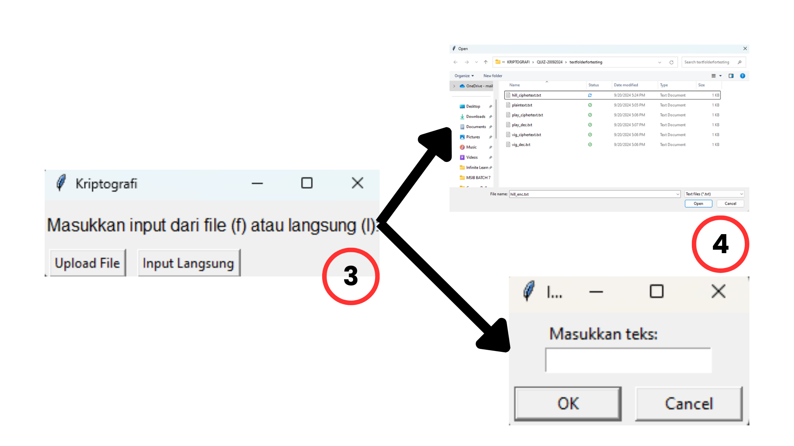
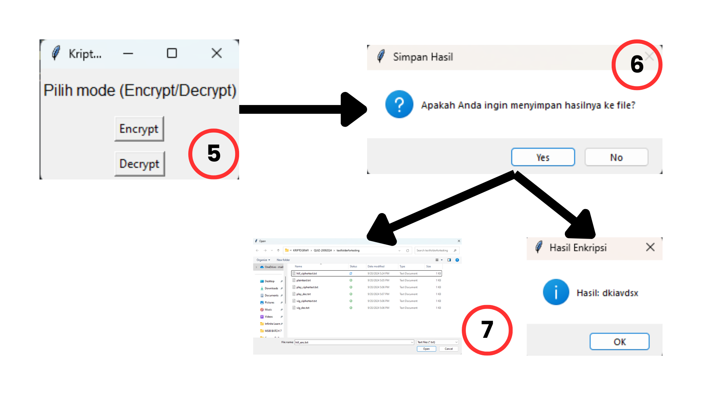
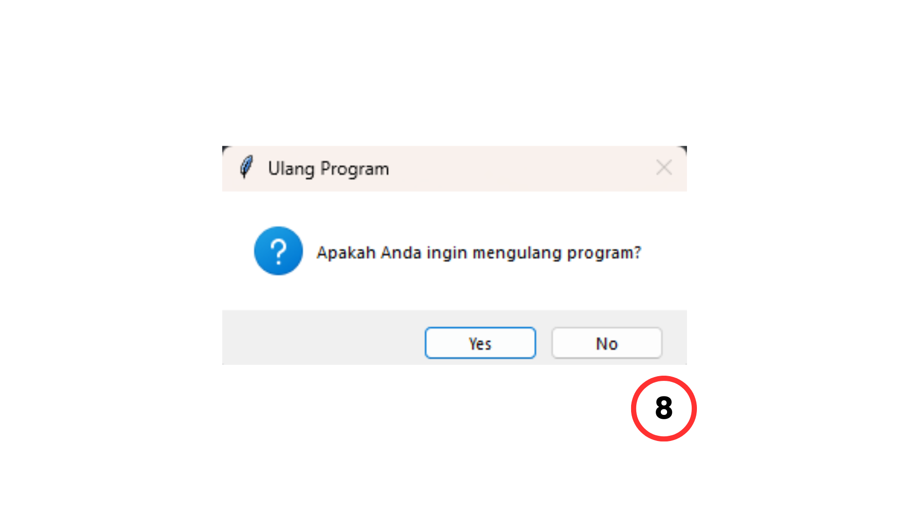

# Aplikasi Kriptografi

Ini adalah aplikasi sederhana berbasis GUI yang dibangun menggunakan pustaka `tkinter` di Python. Aplikasi ini mendukung tiga metode cipher yang populer: Vigenere, Playfair, dan Hill. Pengguna dapat mengenkripsi atau mendekripsi pesan baik dengan memasukkan teks secara langsung atau mengunggah file.

`Kunci/Password : kriptografi123`

### Fitur Utama:

1. **Enkripsi/Dekripsi menggunakan Cipher Vigenere**  
   Masukkan teks atau unggah file teks, kemudian enkripsi atau dekripsi teks tersebut menggunakan cipher Vigenere dengan kunci yang diberikan oleh pengguna.
2. **Enkripsi/Dekripsi menggunakan Cipher Playfair**  
   Cipher Playfair mengkodekan huruf secara berpasangan. Pengguna dapat memasukkan teks atau menggunakan file untuk mengenkripsi atau mendekripsi pesan dengan kunci yang dipilih.
3. **Enkripsi/Dekripsi menggunakan Cipher Hill**  
   Cipher ini menggunakan manipulasi matriks untuk pengkodean dan penguraian kode. Pengguna bisa memasukkan kunci 4 huruf untuk membentuk matriks 2x2.

4. **Pilihan Unggah/Simpan File**  
   Pengguna dapat mengunggah file `.txt` sebagai input untuk enkripsi atau dekripsi, dan menyimpan hasil teks yang dienkripsi atau didekripsi ke file `.txt`.

## Cara Menggunakan

1. **Download Python**

   - https://www.python.org/ftp/python/3.12.6/python-3.12.6-amd64.exe

2. **Install Numpy dengan pip**

   - pip install numpy

3. **Download Repository dan Menjalankan Program Python**

   - Download repository github secara manual atau dengan git (git clone https://github.com/valselt/tugas1kriptografi-semester5.git)

4. **Masukkan Kunci/Password yang Diinginkan**

   - Setelah memilih cipher, Anda akan diminta untuk memasukkan kunci. Pastikan kunci memenuhi kriteria berikut:
     - Vigenere: Minimal 12 karakter.
     - Playfair: Minimal 12 karakter.
     - Hill: Tepat 4 karakter untuk membentuk matriks 2x2.

5. **Masukkan Plaintext**

   - Anda dapat:
     - Mengunggah file teks (mendukung format `.txt`).
     - Memasukkan teks secara langsung ke dalam program.

6. **Memilih Operasi yang Akan Dijalankan**

   - Pilih antara **Encrypt** (Enkripsi) atau **Decrypt** (Dekripsi) untuk melakukan operasi pada teks.

7. **Simpan atau Lihat Hasil**

   - Setelah proses enkripsi/dekripsi selesai, akan ditanya apakah ingin menyimpan hasilnya ke file atau hanya melihat hasilnya.

8. **Ulangi atau Keluar**
   - Setelah melihat hasilnya, user dapat memilih untuk mengulang program dan menjalankan enkripsi/dekripsi lain atau keluar dari aplikasi.

### Tampilan Antarmuka Program

